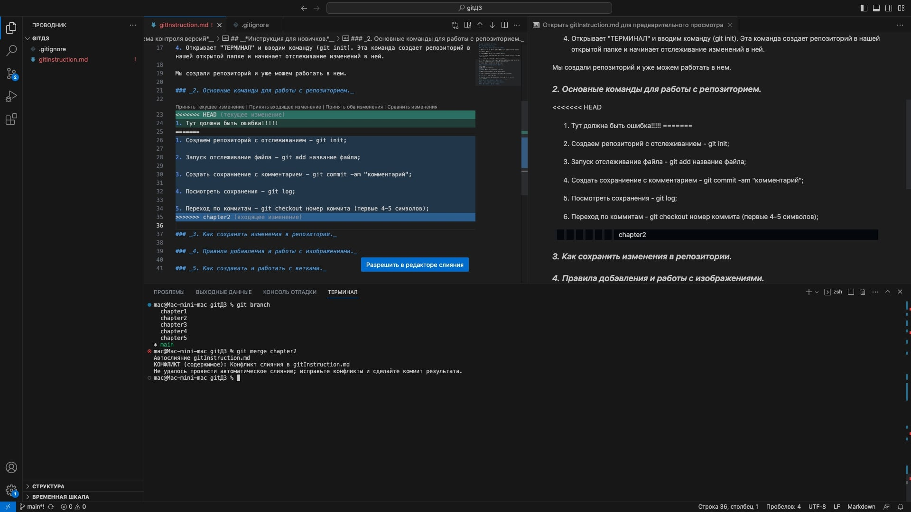

# __*GIT - Система контроля версий*__

## __*Инструкция для новичков.*__

### _1. Как создать репозиторий и для чего он нужен._

~~Репозиторий~~ Git или репозиторий — это папка, в которой Git отслеживает изменения.

#### Для создания репозитория:

1. Создаем папку на рабочем столе с названием проекта;
2. С помошью Visual Studio Code (далее VSC) открываем созданную на рабочем столе папку с нашим проектом;
3. В проводнике VSC создаем файл с нужным расширением;
4. Открывает "ТЕРМИНАЛ" и вводим команду <_git init_>. Эта команда создает репозиторий в нашей открытой папке и начинает отслеживание изменений в ней.

#### Мы создали репозиторий и уже можем работать в нем.

### _2. Основные команды для работы с репозиторием._

1. Создаем репозиторий с отслеживанием - git init;
2. Получить информацию от GIT о его текущем состоянии;
3. Добавить файл к следующему коммиту - git add <название файла>;
4. Создать коммит (сохраниение с комментарием) - git commit -m <комментарий>;
5. Вывод истории всех коммитов с их хеш-кодами - git log;
6. Переход в нужный коммит - git checkout <номер коммита> (первые 4-5 символов).

### _3. Как сохранить изменения в репозитории._

#### Нужно сохраниение???

1. git add название_файла_в_папке - сохраняем файл;
2. git status - проверяем вступило ли в силу изменение;
3. git commit -am "комментарий" - создаем коммит.

### _4. Правила добавления и работы с изображениями._

Для того, чтобы добавить изображение в репозиторий, нужно переместить его в папку, в которой мы создавали репозиторий.

Добавления изображения в текст - .

Например - 

#### !!!ВАЖНО!!!
Не стоит нагружать работу GIT отслеживанием файлов с изображениями, так как GIT предназначен для текста и это может вызвать не корректную работу.

Заставить GIT игнорировать не нужные папки и файлы, включая изображения, можно посредством добавления в репозиторий файла <.gitignore> в котором можно прописать все исключения для отслеживания.

### _5. Как создавать и работать с ветками._

Основные комманды для работы с ветками:

1. _git branch_ - посмотреть список веток (зеленым подсвечивается ветка, на которой Вы сейчас находитесь);
2. _git branch <название ветки>_ - создать новую ветку;
3. _git checkout <название ветки>_ - перейти на указаную ветку;
4. _git merge <название ветки>_ - слияние указанной в команде ветки в ту ветку, в которой Вы в данные момент находитесь;
5. _git branch -d <название ветки>_ - удалить указанную в команде ветку.

### _6. Работа с удаленными репозиториями._

Под удаленными репозиториями подразумеваются те репозитории, которые находяться на удаленном сервере или ресурсе.

#### Основные команды для работы с удаленными репзиториями.

1. _git clone <url-адрес репозитория>_ – клонирование внешнего репозитория на локальный ПК;
2. _cd <название дериктории>_ - перейти в нужную дерикторию после клонирования;
3. _git pull_ – получение изменений и слияние с локальной версией;
4. _git push_ – отправляет локальную версию репозитория на внешний.